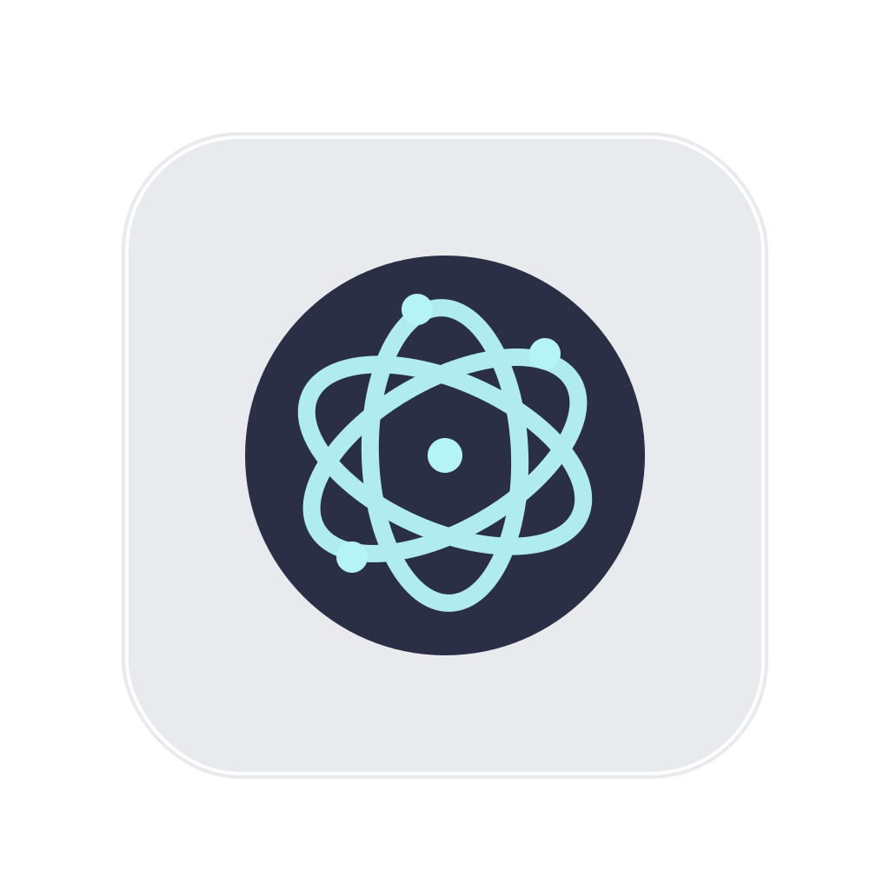

# AstraShell



AstraShell 是一个面向中文用户的桌面运维终端，聚合 SSH、SFTP、密钥仓库、代码片段、串口与版本更新能力，目标是让“连接服务器到执行运维动作”变成单一工作流。


## 核心能力

| 模块 | 说明 | 当前状态 |
| --- | --- | --- |
| SSH 管理台 | 分类管理主机、卡片选择/编辑分离、双击直连终端 | 已可用 |
| 终端会话 | xterm 交互、右键复制粘贴、快捷键复制粘贴 | 已可用 |
| SFTP 双栏 | 左右独立连接（本地/远程），拖拽上传下载，排序 | 已可用 |
| Windows 本地盘符 | 本地目录根层自动列出 `C:/D:/E:` 等盘符 | 已可用 |
| 密钥仓库 | 初始化/解锁主密钥，保存私钥/公钥/证书（至少填一项） | 已可用 |
| 代码片段 | 分类管理脚本，终端中可直接执行/发送原文 | 已可用 |
| 串口工具 | 端口扫描、连接、ASCII/HEX、定时发送 | 已可用 |
| 自动更新 | GitHub Release 检查更新（私有仓库需公开或授权） | 已可用 |

## 使用流程（新用户）

1. 首次启动先选择数据库位置并初始化密钥仓库。
2. 进入主机页，新建 SSH 主机或导入已有主机信息。
3. 单击卡片选中，点编辑按钮改参数；双击卡片直接连接终端。
4. 进入 SFTP 页面，分别为左/右两侧选择“本地或远程”连接。
5. 在代码片段页维护常用命令，在终端工具栏直接调用执行。

## 平台说明

| 平台 | 形态 | 状态 |
| --- | --- | --- |
| macOS (Apple Silicon) | Electron Desktop | 主线版本 |
| Windows x64 | Electron Desktop (NSIS) | 已支持 |
| Android | Expo/React Native 客户端 | 开发中 |
| iOS | Expo/React Native 客户端 | 开发中 |

## 本地开发

### 桌面端

```bash
cd app
npm install
npm run dev
```

### 移动端（Android/iOS 同一套代码）

```bash
cd mobile
npm install
npm run start
```

然后在 Expo DevTools 中选择：
- `a` 启动 Android 模拟器
- `i` 启动 iOS 模拟器（仅 macOS）

## 打包

### 桌面端全量打包

```bash
cd app
npm run dist
```

### 仅打 Windows 安装包

```bash
cd app
npx electron-builder --win --x64
```

## 常见问题

### 1) macOS 提示 “已损坏，无法打开”

从网络来源下载后可执行：

```bash
xattr -dr com.apple.quarantine /Applications/AstraShell.app
```

### 2) Windows 提示 `Installer integrity check has failed`

先校验安装包 SHA256，确认文件未损坏：

```powershell
Get-FileHash -Algorithm SHA256 "AstraShell Setup x.y.z.exe"
```

### 3) Windows 升级时提示卸载失败

先完全退出 AstraShell，再执行安装包；当前安装器已加入强制结束旧进程与卸载兜底逻辑。

## 项目结构

```text
AstraShell/
├─ app/            # Electron + Vue3 桌面端
├─ mobile/         # Expo React Native（Android/iOS）
├─ docs/           # 截图、发布说明
└─ 资料/            # 本地交接资料（不上传 GitHub）
```

## 发布渠道

- 仓库：<https://github.com/getiid/AstraShell>
- 桌面端安装包：GitHub Releases 附件（`.dmg` / `.exe`）
